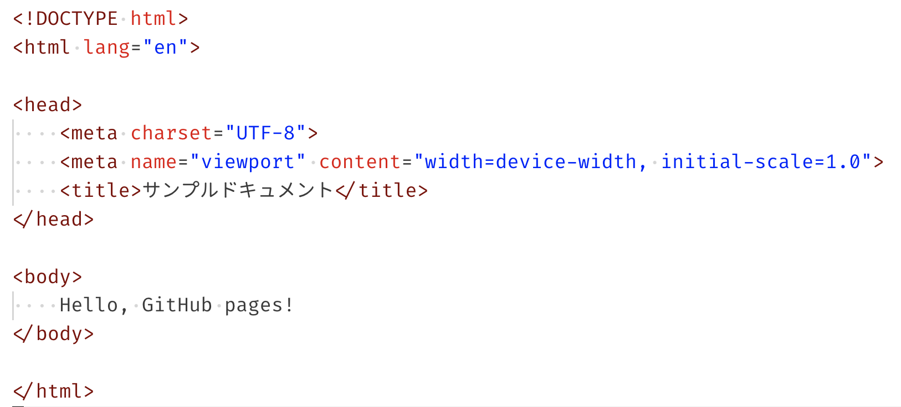
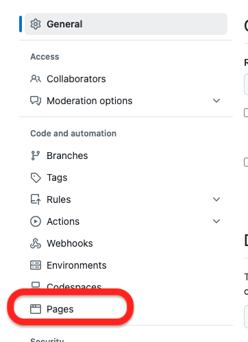
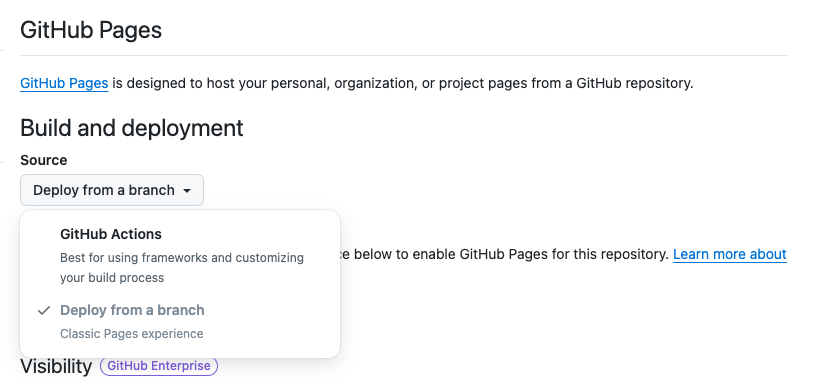
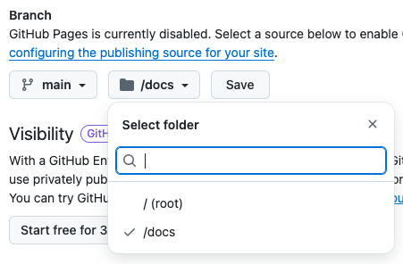
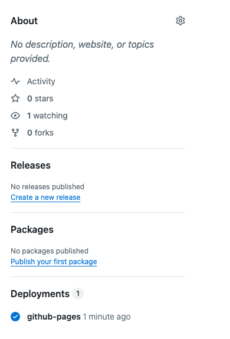

<!--
_color: white
-->


# GitHub Pagesセミナー

SATO Daisuke <densuke@st.kobedenshi.ac.jp>

---
<!--
theme: gaia
pagenate: true
-->
# なにをするの?

- GitHub Pagesの使い方を学ぶ
- ドキュメントをソースに添付する場合に有用
- プレゼンテーションの作成にも使える
- その他いろいろかんがえられます

---
# GitHub Pagesとは?

- GitHubのリポジトリにてドキュメント(Webページ)を公開できる
- 公開できるのは静的なページに限定される
- github上のURLとしてアクセスできる
- 無茶なことをしなければ原則無料

**これを使わない手はない!**

---
# ハンズオン形式です

- この資料を基に実際に作ってみましょう

## 準備

- 自身のGitHub上でリポジトリ(Public)を作って下さい
- ローカルにクローンしておいてください

---

# ファイルを準備する

リポジトリ上に `docs/index.html` を作成してください。作成後、コミットしてPushしておく。

```file:docs/index.html
<!-- body部分のみ抜粋 -->
<body>
    Hello, GitHub pages!
</body>
```


---
# index.htmlについて

`index.html` ファイルは、該当ディレクトリをWebサーバー経由でアクセスした際のデフォルトファイルとして扱われます。
- ただしこれは**慣例**(いわゆる『デファクトスタンダード』)
- WindowsというかIISの場合だと、`default.htm`なんてのもあったりする
    - 特級呪物的存在

---
# GitHub Pagesの設定(1)



- GitHubのリポジトリを開き、設定(Settings)を確認する

---
# GitHub Pagesの設定(2)

**Build and deployment**を確認する(2つある)


---
# GitHub Pagesの設定(3)

やり方は2通りあります

- GitHub Actions
    - GitHub上のCI/CDとして設定する
    - 少し難しいが後半に行います
- Deploy from a branch
    - 特定のブランチを指定する形で行う
    - まずこちらを使ってみます
    - おそらく**初期状態で設定済み**

---
# GitHub Pagesの設定(4)

初期状態ではブランチ指定が無し(None)なので、**mainブランチを選択**してみましょう。
ページのソースとして利用したいブランチを指定するということです。


---
# GitHub Pagesの設定(5)

どこのディレクトリを公開するかを指定します。
今回`docs`ディレクトリに`index.html`を作成したので、それ(`docs`)を指定します。
設定後保存(`Save`)を押してください。



---
# GitHub Pagesの設定(6)

- 保存後、青く"GitHub Pages souce saved"が出ていれば完了
- リポジトリのトップに戻り、少し(〜1,2分程度)待つと右下に"Deployments"として案内が出ます



---
# 実際の表示&ソース


※ AdGuardによるHTML挿入がありますが無視してください

---
# ここまでのまとめ

- `docs`ディレクトリ以下にてHTMLを作成する
- `docs`ディレクトリを基準とした相対パスで各種静的ファイルは呼び出し可能
    - JavaScript(.js)
    - CSS(.css)
    - 画像や音声(.png, .jpg, .mp3, etc)
        - ただし大きすぎるファイルは拒絶されることがあるので、動画は特にYouTube等に逃して埋め込みする方が安全です

---
# Actionsを用いたデプロイ

- 単純なファイル公開ではない方法を求める場合は、GitHub Actionsを利用することになる
- MarkdownテキストをHTMLに変換する
- テンプレートエンジンやドキュメントジェネレータを使った生成
    - [Marp](https://marp.app/)
    - [Hugo](https://gohugo.io/)
    - [Jekyll](https://jekyllrb.com/)
    - [Sphinx](https://www.sphinx-doc.org/en/master/) などなど

今回はこちらは割愛しますが、調べておくと実務や趣味で役立つぞ
